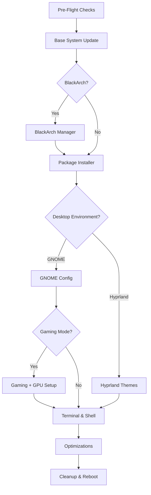
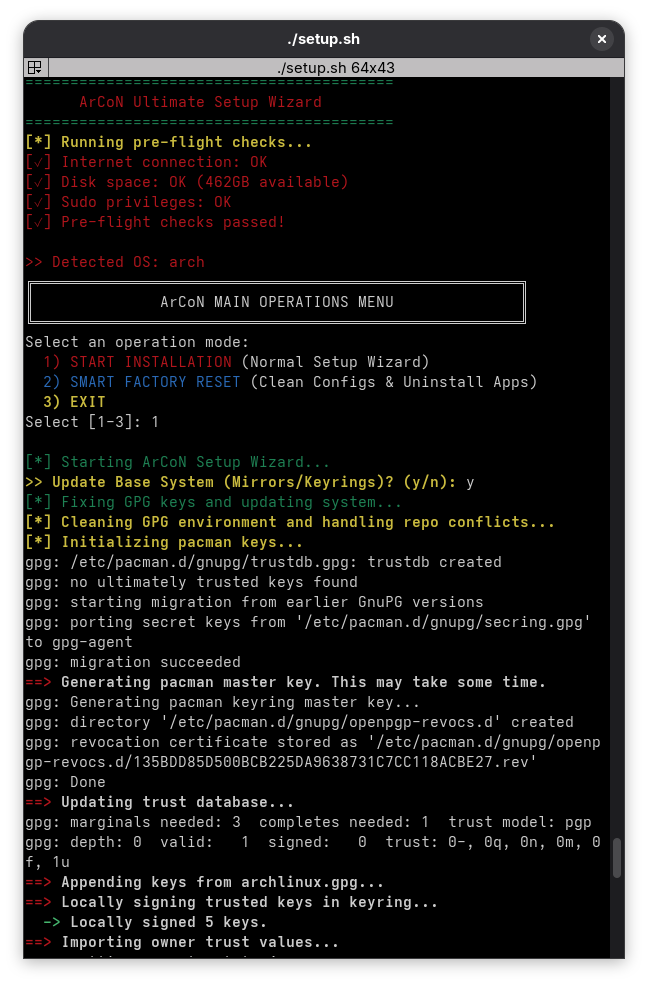
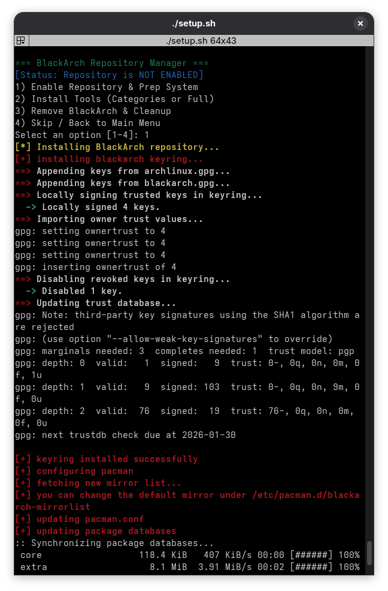

# 🐧 ArCoN v3
## *Global Standard, Optimized, Anonymized & Gaming Ready*

[](LICENSE)
[](https://archlinux.org)
[](https://github.com/mrfedai/ArCoN)
[](https://www.gnu.org/software/bash/)

> **The ultimate Arch Linux automation toolkit.** One script. Infinite possibilities.  
> Transform a fresh Arch install into a battle-ready powerhouse in under 30 minutes.

---

## ⚡ One-Line Setup

```bash
sudo pacman -S --needed --noconfirm git && git clone https://github.com/mrfedai/ArCoN.git && cd ArCoN && chmod +x setup.sh && ./setup.sh
```

**That's it.** No manual config editing. No dependency hell. Just run it.

---

## 🔥 Why ArCoN?

| Traditional Arch Setup | ArCoN Way |
|------------------------|-----------|
| 4+ hours of manual setup | **15-30 minutes** automated |
| Googling package names | **Smart package database** with descriptions |
| Breaking the system 3 times | **Built-in conflict resolution** |
| Copy-pasting random dotfiles | **Curated themes** with one-click install |
| "Why isn't Steam working?" | **Gaming Mode** with GPU auto-detect |
| Manual security hardening | **Hardened Mode** with OpenSnitch + USBGuard |

---

## 🚀 Sector-Based Architecture

ArCoN operates in **modular sectors**—each handling a critical system component. You choose what to activate:

### **📡 Sector 1: Base System**
- **GPG Auto-Fix**: Handles Docker/Live USB conflicts
- **Reflector Live Output**: Real-time mirror benchmarking (colored + numbered)
  ```
  1) speed: 2.6 MiB/s ✅
  2) speed: 1.8 MiB/s ✅
  3) speed: 0.0 MiB/s ❌
  ```
- **YAY Installation**: AUR helper with automatic dependency resolution
- **Smart Keyring Management**: Auto-signs BlackArch keys if present

### **🛡️ Sector 2: Cyber Security**
#### **BlackArch Repository Manager**
- **Smart Conflict Resolution**:
  - Auto-handles Java/Rust/OpenCL provider locks
  - Temporary BlackArch disable during keyring updates
  - Safe key signing (noptrix/4345771566D76030457303332944B067D796237B)
- **Category-Based Installer**:
  ```
  1) Full BlackArch (All Tools - 20GB+)
  2) Core Pentest Groups (WebApp, Networking, Wireless)
  3) Back
  
  ========== SELECTION GUIDE ==========
   - Press [Enter] for ALL (Default)
   - Type 1 5 10 for specific tools
   - Type ^10 ^15 to EXCLUDE packages
   - Range: 1-50 (Installs first 50)
  ```
- **Safe Removal**: Cleans keys and repo config

### **📦 Sector 3: Package Engine**
#### **Visual Progress Bar System**
```
[████████████████████░░░░░░░░░░░░░░░░░] 65%
Processing: firefox
```

#### **Smart Installation Preview**
```
========== INSTALLATION PREVIEW ==========
PACKAGE NAME     | STATUS / SIZE
-----------------|----------------------
vim              | INSTALLED
git              | INSTALLED
firefox          | 50.5 MiB 🟢
metasploit       | 500.2 MiB 🔴
yay              | (AUR Build) 🟡
==========================================
>> Total Download Required: ~550.70 MB
>> Queued: 2 Official, 1 AUR packages
```

**Features:**
- **Smart Skip**: Auto-detects installed packages
- **Color-Coded Sizes**:
  - 🟢 Green: <100MB
  - 🔴 Red: >100MB
  - 🟡 Yellow: AUR builds
- **Resume Support**: Continues after interruptions
- **Zero Division Fix**: Handles empty package lists gracefully

### **🎮 Sector 4: Gaming Beast**
#### **Unified Gaming + GPU Stack**
```
>> Enable Gaming Mode (Steam, GPU Drivers)? (y/n): y

Select your GPU for optimized drivers:
1) Nvidia
2) AMD
3) Intel
4) Skip

[*] Checking missing packages...
[SKIP] steam is already installed.
[+] Queued for install: nvidia-utils

[████████████████████████████████████████] 100%
[✓] Gaming Environment Ready!
```

**Features:**
- Auto-enables `multilib` repository
- Installs: Steam, GameMode, lib32-gamemode
- **GPU Auto-Detection**:
  - **NVIDIA**: nvidia-utils, lib32-nvidia-utils, nvidia-settings
  - **AMD**: mesa, lib32-mesa, xf86-video-amdgpu, vulkan-radeon
  - **Intel**: mesa, lib32-mesa, vulkan-intel
- Creates `~/.config/gamemode/gamemode.ini` with performance settings
- Adds user to `gamemode` group
- **Chained Setup**: Requires Sector 6 (GNOME) as dependency

**Post-Install Note (NVIDIA):**
```
[NOTE] Add 'nvidia nvidia_modeset nvidia_uvm nvidia_drm' to /etc/mkinitcpio.conf
```

### **🖥️ Sector 5: Hyprland Ricing**
#### **4 Premium Themes (One-Click Install)**
```
========================================
      SELECT A HYPRLAND THEME (DOTFILES)
========================================
1) Ax-Shell (Minimal & Clean)
2) Hyprdots (Feature Rich)
3) ML4W (Beginner Friendly)
4) JaKooLit (Gaming Optimized)
5) Skip Theme
```

**Smart Installation:**
- Checks each package: `hyprland`, `hyprlock`, `hypridle`, `waybar`, `kitty`, `wofi`, `dolphin`
- Skips installed components
- **Config Backup**: Timestamped backup (`~/.config/hypr.bak_TIMESTAMP`)
- **Pre-Install Editing**: Edit installer scripts before running (debloat option)

**Theme Details:**
- **Ax-Shell**: Minimalist design, lightweight
- **Hyprdots**: Feature-rich (Prasanth Rangan's config)
- **ML4W**: Beginner-friendly (Stephan Raabe's setup)
- **JaKooLit**: Gaming-optimized with performance tweaks

### **🎨 Sector 6: GNOME Environment**
#### **Single-File Configuration**
```
[*] Configuring GNOME environment...
[*] Resetting App Folders (UUID cleanup)...
[*] Loading configuration from gno.conf...
[OK] GNOME settings applied successfully.
```

**Features:**
- **Single Config File**: `configs/gno.conf`
- **UUID Conflict Resolution**: Resets app folders before loading
- **USER_PLACEHOLDER Auto-Replace**: Dynamically inserts current username
- **Custom Keybindings**:
  - `Alt+Return` → Terminator
  - `Alt+F` → Browser
  - `Alt+G` → File Manager
  - `Alt+W` → Close Window
  - `Alt+T` → Screenshot

**Optional Debloat:**
```
>> Remove GNOME Bloatware? (y/n): y
[*] Removing bloatware...
Targets: gnome-tour, gnome-weather, gnome-maps, gnome-contacts,
         gnome-music, gnome-console, epiphany
[OK] System cleaned.
```

**Gaming Dependency:**  
Sector 4 (Gaming Mode) requires Sector 6 to be configured first.

### **🖼️ Sector 7: Terminal Paradise** *(NEW in v2.4)*
#### **Terminal Emulator Selection**
```
=== TERMINAL EMULATOR SELECTION ===
1) Terminator (Advanced Tiling)
2) Kitty (GPU Accelerated)
3) Alacritty (Fastest)
4) Gnome-Terminal
5) Skip
```

#### **Kitty Theme Downloader** (if Kitty selected)
```
=== KITTY THEME SELECTION ===
1) Dracula
2) Nord
3) Gruvbox Dark
4) Tokyo Night
5) Cyberpunk
6) Skip

[*] Downloading theme: Tokyo Night...
[✓] Kitty theme applied.
```

#### **Shell Configuration**
```
=== PREFERRED SHELL & THEME CONFIG ===
(Current Shell: bash)

1) Zsh (Themes: P10k, Agnoster...)
2) Fish (Themes: Starship Presets)
3) Bash (Themes: Starship Presets)
4) Skip
```

**Zsh Themes:**
```
=== ZSH THEME PREVIEW ===
1) agnoster (Powerline)
2) robbyrussell (Simple)
3) bira (Informative)
4) powerlevel10k (Ultimate)

[*] Installing Powerlevel10k...
[✓] .zshrc updated with new theme.
```

**Fish/Bash Starship Presets:**
- Pastel (Colorful)
- Tokyo Night (Dark)
- Pure (Minimal)
- Gruvbox (Retro)

**Smart Features:**
- **Shell Detection**: Only changes shell if different from current
- **Theme-Only Updates**: Reconfigure themes without switching shells
- **Nerd Font Auto-Install**: JetBrainsMono for icon support (Arch only)

### **⚙️ Sector 9: Optimizations**
```
>> Apply System Optimizations (SSD, BT, Firewall)? (y/n): y

[*] Applying optimizations...
[*] Enabling SSD TRIM scheduler...
[*] Auto-enabling Bluetooth...
[*] Activating UFW Firewall...
[*] Cleaning package cache...
[OK] Optimizations complete.
```

**Features:**
- SSD TRIM scheduling (`fstrim.timer`)
- Bluetooth auto-enable (`/etc/bluetooth/main.conf`)
- UFW firewall activation
- Orphaned package removal (`pacman -Qtdq`)
- Cache cleanup

---

## 🎯 Feature Highlights

### 🔍 **Pre-Flight Safety System**
```
[*] Running pre-flight checks...
[✓] Internet connection: OK
[✓] Disk space: OK (45GB available)
[✓] Sudo privileges: OK
[✓] Pre-flight checks passed!
```

Validates:
- Internet (Google + 8.8.8.8 fallback)
- Disk space (10GB minimum)
- Sudo privileges
- Live USB detection (with warning)

### 🔄 **Resume System** *(NEW)*
```
╔════════════════════════════════════════════╗
║     🔄 PREVIOUS INSTALLATION DETECTED      ║
╚════════════════════════════════════════════╝
[INFO] Found 15 packages already installed
>> Resume from last checkpoint? (y/n): y
[✓] Resume mode enabled
```

**How It Works:**
- Logs installed packages to `~/.arcon_progress.log`
- Detects interrupted installations
- Skips already-installed packages
- Deletes log after successful completion

### 🧠 **Intelligent Conflict Resolution**
- **GPG Conflicts**: Auto-disables BlackArch during keyring updates
- **Provider Locks**: Pre-installs Java/Rust/OpenCL for BlackArch
- **Multilib**: Auto-enables for gaming/GPU drivers
- **Zero Division Protection**: Handles empty package lists

### 🎨 **Live Mirror Benchmarking** *(Unique Feature)*
```
[*] Benchmarking top 20 HTTPS mirrors... (Live Output)
[INFO] Colors: >0 (Success) | 0 (Timeout/Fail)
 1) speed: 2.6 MiB/s ✅
 2) speed: 1.8 MiB/s ✅
 3) speed: 0.0 MiB/s ❌
...
[INFO] Final Selection (Top 10 Fastest):
 1. https://mirror.pkgbuild.com/$repo/os/$arch
 2. https://geo.mirror.pkgbuild.com/$repo/os/$arch
```

---

## 📋 Installation Flow (30-Minute Journey)



---

## 🛠️ Customization

### **Add Your Own Packages**
Edit `pacs.txt` before running:
```bash
# === CUSTOM PACKAGES ===
code
discord
spotify
obs-studio
```

### **Custom GNOME Settings**
Modify `configs/gno.conf`:
```ini
[org/gnome/desktop/wm/keybindings]
close=['<Alt>w']
minimize=['<Alt>d']

[org/gnome/shell]
favorite-apps=['nautilus.desktop', 'terminator.desktop']
```

### **Hyprland Dotfiles**
Place custom configs in `configs/hypr/`:
```
configs/hypr/
├── hyprland.conf
├── hyprlock.conf
└── waybar/
    └── config
```

---

## 🚨 Important Notes

### **Live USB Warning**
```
╔════════════════════════════════════════════╗
║        ⚠️  LIVE ENVIRONMENT DETECTED  ⚠️      ║
╚════════════════════════════════════════════╝
[WARNING] All changes will be LOST after reboot!
```
**Fix**: Install Arch to disk, then run ArCoN.

### **NVIDIA Users**
After installation:
```bash
# Edit /etc/mkinitcpio.conf
MODULES=(nvidia nvidia_modeset nvidia_uvm nvidia_drm)

# Regenerate initramfs
sudo mkinitcpio -P
```

### **BlackArch GPG Auto-Fix**
Script automatically:
1. Disables BlackArch temporarily
2. Updates keyrings
3. Re-enables + signs keys (4345771566D76030457303332944B067D796237B)

### **Shell Switching**
- **Smart Detection**: Only changes if different
- **Theme Updates**: Reconfigure without switching
- **Logout Required**: New shell activates after logout

---

## 📊 Statistics

| Metric | Value |
|--------|-------|
| **Lines of Code** | ~1200 |
| **Supported Packages** | 57 (default) / Unlimited (custom) |
| **Desktop Environments** | 2 (GNOME, Hyprland) |
| **Shell Options** | 3 (Zsh, Fish, Bash) |
| **Terminal Emulators** | 4 |
| **Hyprland Themes** | 4 |
| **Zsh Themes** | 4 |
| **Starship Presets** | 4 |
| **Average Setup Time** | 15-30 minutes |

---

## 🖼️ Screenshots

### Sector 1: Base System Update


### Sector 2: BlackArch Manager
![BlackArch Menu]

### Sector 3: Package Installer

### Sector 4: Gaming Setup

### Sector 5: Hyprland Themes

### Sector 6: GNOME Configuration

### Sector 7: Terminal Setup

*Replace placeholders with real screenshots after installation!*

---

## 📜 Changelog

### **v2.4** (Current) - *The Beast Update*
**New Features:**
- 🎮 **Unified Gaming + GPU**: Chained setup (requires GNOME)
- 🛡️ **BlackArch Manager**: Interactive menu with smart conflict resolution
- 📊 **Visual Progress Bars**: Real-time installation feedback
- 🖼️ **Terminal Paradise**: Emulator + Shell + Theme configuration
- 🎨 **Hyprland Themes**: 4 pre-configured dotfiles with pre-edit option
- 🔍 **Reflector Live Output**: Numbered + colored mirror benchmarking
- 🔄 **Resume System**: Automatic progress tracking (`.arcon_progress.log`)
- 🧹 **Smart Cleanup**: Orphan + cache removal
- 🛡️ **GPG Auto-Fix**: Handles Docker/Live USB conflicts
- 🧠 **Zero Division Protection**: Fixed empty package list handling

**Improvements:**
- Smart Skip System for all package installations
- Config backup with timestamps (Hyprland)
- Shell detection (only switches if different)
- Nerd Font auto-install (JetBrainsMono)
- Error handling improvements

### **v2.3**
- Interactive package builder with TUI
- Pre-flight safety checks
- Live USB detection

### **v2.2**
- English translation (all comments)
- Enhanced error handling

### **v2.1**
- Gaming Mode automation
- GNOME UUID conflict resolution

---

## 🤝 Contributing

Want to make ArCoN even better? Here's how:

1. **Fork** the repo
2. **Create** a feature branch: `git checkout -b feature/EpicFeature`
3. **Commit** your changes: `git commit -m 'Add EpicFeature'`
4. **Push**: `git push origin feature/EpicFeature`
5. **Open** a Pull Request

### **Ideas We'd Love:**
- Support for other distros (Fedora, Manjaro)
- More Hyprland themes
- Gaming benchmarking tools
- Docker container support
- Automated testing framework

---

## 📄 License

MIT License - Do whatever you want, just keep the credits.

---

## 🙏 Credits & Inspiration

### **Hyprland Themes**
- [Ax-Shell](https://github.com/Axenide/Ax-Shell) by Axenide
- [Hyprdots](https://github.com/prasanthrangan/hyprdots) by Prasanth Rangan
- [ML4W](https://github.com/mylinuxforwork/dotfiles) by Stephan Raabe
- [JaKooLit](https://github.com/JaKooLit/Hyprland-Dots) by JaKooLit

### **Tools & Frameworks**
- [Oh-My-Zsh](https://github.com/ohmyzsh/ohmyzsh) - Zsh framework
- [Starship](https://github.com/starship/starship) - Cross-shell prompt
- [Powerlevel10k](https://github.com/romkatv/powerlevel10k) - Zsh theme
- [Reflector](https://xyne.dev/projects/reflector/) - Mirror optimization

---

## 📧 Support & Community

- 🐛 **Bug Reports**: [GitHub Issues](https://github.com/mrfedai/ArCoN/issues)
- 💬 **Discussions**: [GitHub Discussions](https://github.com/mrfedai/ArCoN/discussions)
- 📧 **Email**: fedai1453.gok@gmail.com
- 🌟 **Star the repo** if this saved you hours of setup time!

---

<div align="center">

### **Made with ❤️ and ☕ for the Arch Linux community**

[](https://github.com/mrfedai/ArCoN/stargazers)
[](https://github.com/mrfedai/ArCoN/network/members)

*"I use Arch, btw... and ArCoN made it easy."*

</div>
