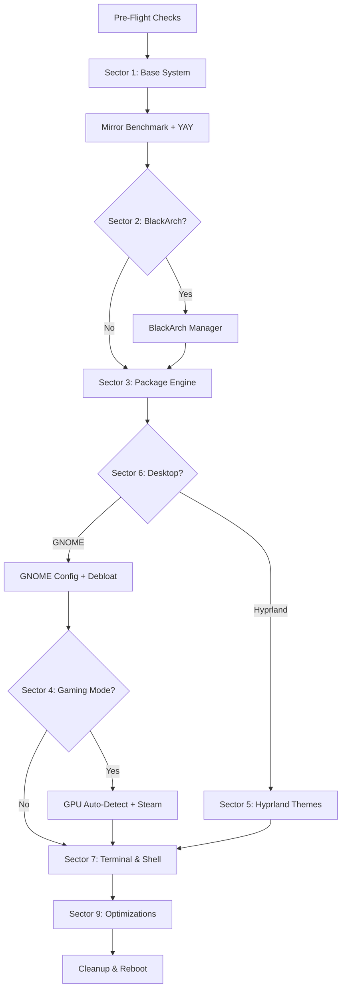

# 🐧 ArCoN v2.5
**Arch Linux setup automation — one script, battle-ready system in 30 minutes.**

[](LICENSE)
[](https://archlinux.org)
[](https://github.com/mrfedai/ArCoN)
[](https://www.gnu.org/software/bash/)

> **The ultimate Arch Linux automation toolkit.** One script. Infinite possibilities.  
> Transform a fresh Arch install into a battle-ready powerhouse in under 30 minutes.

---

## ⚡ One-Line Setup

```bash
sudo pacman -S --needed --noconfirm git && git clone https://github.com/mrfedai/ArCoN.git && cd ArCoN && chmod +x setup.sh && ./setup.sh
```

**That's it.** No manual config editing. No dependency hell. Just run it.

---

## 🔥 Why ArCoN?

| Traditional Arch Setup | ArCoN Way |
|------------------------|-----------|
| 4+ hours of manual setup | **15-30 minutes** automated |
| Googling package names | **Smart package database** with descriptions |
| Breaking the system 3 times | **Built-in conflict resolution** |
| Copy-pasting random dotfiles | **Curated themes** with one-click install |
| "Why isn't Steam working?" | **Gaming Mode** with GPU auto-detect |
| Manual security hardening | **Hardened Mode** with OpenSnitch + USBGuard |

---

## 🚀 Modular Architecture (Sectors)

| Sector | Function |
|--------|----------|
| **1 — Base System** | GPG auto-fix, live mirror benchmarking, YAY installation |
| **2 — Cyber Security** | BlackArch repo manager, category-based tool installation |
| **3 — Package Engine** | Visual progress bar, smart package preview & installation |
| **4 — Gaming** | Steam, GPU drivers (NVIDIA/AMD/Intel), GameMode |
| **5 — Hyprland** | 4 ready-made themes: Ax-Shell, Hyprdots, ML4W, JaKooLit |
| **6 — GNOME** | Auto-configuration, custom keybindings, debloat |
| **7 — Terminal** | Terminator/Kitty/Alacritty + Zsh/Fish/Bash theme setup |
| **9 — Optimizations** | SSD TRIM, UFW firewall, Bluetooth, cache cleanup |

---

## ⚠️ Important Notes

- **Live USB users**: All changes are lost after reboot. Install Arch to disk first.
- **NVIDIA users**: After installation, add `nvidia nvidia_modeset nvidia_uvm nvidia_drm` to `/etc/mkinitcpio.conf` and run `sudo mkinitcpio -P`.
- **Gaming Mode** (Sector 4) requires Sector 6 (GNOME) to be configured first.

---
## 🎯 Key Features

- **Pre-Flight Checks**: Validates internet, disk space (min 10GB), and sudo privileges
- **Resume System**: Interrupted installations automatically continue from last checkpoint
- **Smart Conflict Resolution**: GPG, Java/Rust/OpenCL provider locks handled automatically
- **Visual Progress Bar**: Real-time installation tracking
- **Live Mirror Benchmark**: Top 10 fastest Arch mirrors selected automatically

---

## 🛠️ Customization

Add your own packages to `pacs.txt` before running:
```
code
discord
obs-studio
```

Edit `configs/gno.conf` for GNOME settings, or `configs/hypr/` for Hyprland configs.

---


## 📊 At a Glance

| | |
|--|--|
| Lines of code | ~1200 |
| Default packages | 57 |
| Desktop environments | GNOME, Hyprland |
| Shell options | Zsh, Fish, Bash |
| Average setup time | 15–30 min |

---

## 📋 Installation Flow (30-Minute Journey)


```mermaid
graph TD
    A[Pre-Flight Checks] --> B[Sector 1: Base System]
    B --> C[Mirror Benchmark + YAY]
    C --> D{Sector 2: BlackArch?}
    D -->|Yes| E[BlackArch Manager]
    D -->|No| F[Sector 3: Package Engine]
    E --> F
    F --> G{Sector 6: Desktop?}
    G -->|GNOME| H[GNOME Config + Debloat]
    G -->|Hyprland| I[Sector 5: Hyprland Themes]
    H --> J{Sector 4: Gaming Mode?}
    J -->|Yes| K[GPU Auto-Detect + Steam]
    J -->|No| L[Sector 7: Terminal & Shell]
    K --> L
    I --> L
    L --> M[Sector 9: Optimizations]
    M --> N[Cleanup & Reboot]
```

---

## 🔮 Coming in v3.0

- **Cross-Platform Support** — Full compatibility with all Linux & Unix-based systems (Debian, Fedora, openSUSE, macOS and more)
- **Object-Oriented Rewrite** — Entire codebase refactored into modular OOP architecture for easier maintenance and contribution
- **Auto Hardware Detection** — GPU, CPU, and system specs detected automatically; drivers and updates applied accordingly — no manual selection needed

---

## 📜 Changelog

### **v2.5** (Current) - *The Beast Update*
**New Features:**
- 🎮 **Unified Gaming + GPU**: Chained setup (requires GNOME)
- 🛡️ **BlackArch Manager**: Interactive menu with smart conflict resolution
- 📊 **Visual Progress Bars**: Real-time installation feedback
- 🖼️ **Terminal Paradise**: Emulator + Shell + Theme configuration
- 🎨 **Hyprland Themes**: 4 pre-configured dotfiles with pre-edit option
- 🔍 **Reflector Live Output**: Numbered + colored mirror benchmarking
- 🔄 **Resume System**: Automatic progress tracking (`.arcon_progress.log`)
- 🧹 **Smart Cleanup**: Orphan + cache removal
- 🛡️ **GPG Auto-Fix**: Handles Docker/Live USB conflicts
- 🧠 **Zero Division Protection**: Fixed empty package list handling


## 🤝 Contributing

Want to make ArCoN even better? Here's how:

1. **Fork** the repo
2. **Create** a feature branch: `git checkout -b feature/EpicFeature`
3. **Commit** your changes: `git commit -m 'Add EpicFeature'`
4. **Push**: `git push origin feature/EpicFeature`
5. **Open** a Pull Request

### **Ideas We'd Love:**
- Support for other distros (Fedora, Manjaro)
- More Hyprland themes
- Gaming benchmarking tools
- Docker container support
- Automated testing framework

---

## 📄 License

MIT License - Do whatever you want, just keep the credits.

---

## 🙏 Credits & Inspiration

### **Hyprland Themes**
- [Ax-Shell](https://github.com/Axenide/Ax-Shell) by Axenide
- [Hyprdots](https://github.com/prasanthrangan/hyprdots) by Prasanth Rangan
- [ML4W](https://github.com/mylinuxforwork/dotfiles) by Stephan Raabe
- [JaKooLit](https://github.com/JaKooLit/Hyprland-Dots) by JaKooLit
- [BlackArch](https://blackarch.org/) - CyberRepo
- [hyprwm](https://github.com/hyprwm/Hyprland) - Hyprland


### **Tools & Frameworks**
- [Oh-My-Zsh](https://github.com/ohmyzsh/ohmyzsh) - Zsh framework
- [Starship](https://github.com/starship/starship) - Cross-shell prompt
- [Powerlevel10k](https://github.com/romkatv/powerlevel10k) - Zsh theme
- [Reflector](https://xyne.dev/projects/reflector/) - Mirror optimization
- [rkhunter](https://github.com/installation/rkhunter) - Rootkit & Backdoor Hunter
- [clamav](https://github.com/Cisco-Talos/clamav) - Antivirus Engine 
- [lynis](https://github.com/CISOfy/lynis) - System Hardening & Audit Tool
- [Firejail](https://github.com/netblue30/firejail) - Application Sandboxing 
- [arch-audit](https://github.com/ilpianista/arch-audit) - Vulnerability Scanner (CVE Check)
---

## 📧 Support & Community

- 🐛 **Bug Reports**: [GitHub Issues](https://github.com/mrfedai/ArCoN/issues)
- 💬 **Discussions**: [GitHub Discussions](https://github.com/mrfedai/ArCoN/discussions)
- 📧 **Email**: fedai1453.gok@gmail.com
- 🌟 **Star the repo** if this saved you hours of setup time!

---

<div align="center">

### **Made with ❤️ and ☕ for the Arch Linux community**

[](https://github.com/mrfedai/ArCoN/stargazers)
[](https://github.com/mrfedai/ArCoN/network/members)

*"I use Arch, btw... and ArCoN made it easy."*

</div>
